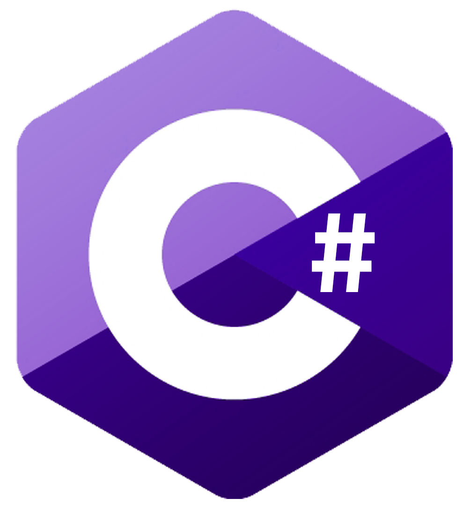

 

<!--  -->

# Hello 👋

## 💻 Things I Love

- Building DevTools, libraries and frameworks
- Software Architecture & System Design
- Backend Development

## Programming Languages

## Current Works

- Working towards my [2023 goals](https://twitter.com/Tony_Barotsis/status/1609131868984860673).

## Other Stuff
- [My Portfolio](https://antoniosbarotsis.github.io/)
- [My Blog](https://antoniosbarotsis.github.io/posts/)
- If you have any suggestions for this readme let me know!

## Latest Blog Posts

<!--START_SECTION:feed-->
* [Simple Rust Function Macros](https:&#x2F;&#x2F;antoniosbarotsis.github.io&#x2F;posts&#x2F;simple_rust_macros&#x2F;)
* [Finding Rust crates](https:&#x2F;&#x2F;antoniosbarotsis.github.io&#x2F;posts&#x2F;finding_rust_crates&#x2F;)
* [Python with a bit of Rust](https:&#x2F;&#x2F;antoniosbarotsis.github.io&#x2F;posts&#x2F;python_package_written_in_rust&#x2F;)
* [2022 Recapped](https:&#x2F;&#x2F;antoniosbarotsis.github.io&#x2F;posts&#x2F;2022-recapped&#x2F;)
* [Rss2Email](https:&#x2F;&#x2F;antoniosbarotsis.github.io&#x2F;posts&#x2F;rss2email&#x2F;)
<!--END_SECTION:feed-->

This section is updated dynamically using [this](https://github.com/JasonEtco/rss-to-readme) action :)

## Some Github Stats

|  |  |
| ------------- | ------------- |

